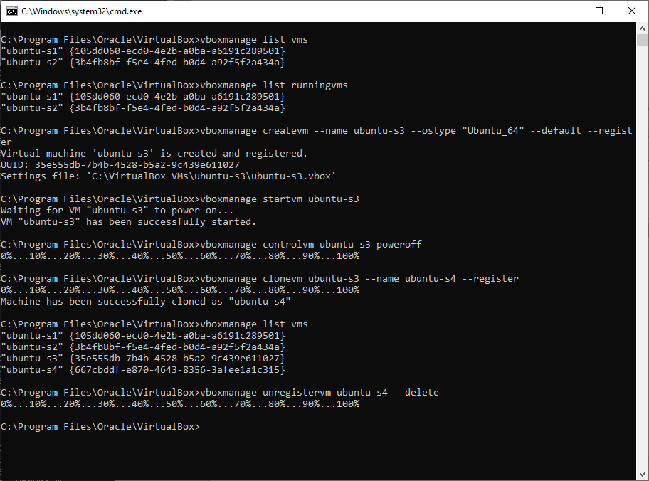

____
### Part 1.

Q: What are the most popular hypervisors for infrastructure virtualization?

A: They are Oracle VM Virtual box, VMWare vSphere, MS Hyper-V

Q: Briefly describe the main differences of the most popular hypervisors

A: There are 2 types of hypervisors:


 Type 1: hypervisor runs directly on the host machine's physical hardware:
    
	VMware ESXi
	Proxmox Virtual Environment
	Microsoft Hyper-V
	open source KVM
	Citrix Hypervisor

  Type 2: hypervisor is installed on top of an existing OS:
    
	VMware Fusion
	Oracle VM VirtualBox
	Parallels Desktop
	VMware Workstation
	VMware Player
	Microsoft Hyper-V
	Windows Virtual PC

Part 2. Work with Virtual box

I installed Virtual box on Ubuntu Desktop (main host) and downloaded latest stable version UbuntuServer (20.04). Then created VM1 and installed Ubuntu


 


 


| Connection                | Ping |   |
|---------------------------|------|---|
| VM1 <\-> VM2 \(Bridged\)  | \+   |   |
| Host<\->VMs \(Bridged\)   | \+   |   |
| Host to VM\(NAT\)         | \-   |   |
| VMs\(NAT\) to internet    | \+   |   |
| VMs\(Bridge\) to internet | \+   |   |
| VMs\(Bridge\) to host     | \+   |   |
| VMs\(NAT\) to host        | \+   |   |


Then work with CLI through VBoxManage:




PART 3. WORK WITH VAGRANT


____
### Vagrant file 
```
### # -*- mode: ruby -*-
# vi: set ft=ruby :

Vagrant.configure(2) do |config|
  config.vm.box = "ubuntu/trusty64"
  config.vm.box_check_update = false


  config.vm.define "dev" do |dev|
      dev.vm.network  "public_network", ip: "192.168.1.160"
      dev.vm.hostname = "dev"  
      dev.vm.provider "virtualbox" do |vb|
         vb.memory = "4096"
      end
  end

  
 config.vm.define "db" do |db|
     db.vm.network "public_network", ip: "192.168.1.161"
     db.vm.hostname = "db"  
     db.vm.provider "virtualbox" do |vb|
         vb.memory = "1024"
     end
 end


 config.vm.define "ci" do |ci|
     ci.vm.network "public_network", ip: "192.168.1.162"
     ci.vm.hostname = "ci"  
     ci.vm.provider "virtualbox" do |vb|
         vb.memory = "2048"
     end
 end

 config.vm.define "lamp" do |lamp|
     lamp.vm.network "public_network", ip: "192.168.1.163"
     lamp.vm.hostname = "lamp"  
     lamp.vm.provider "virtualbox" do |vb|
         vb.memory = "512"
     end
 end

end

```


