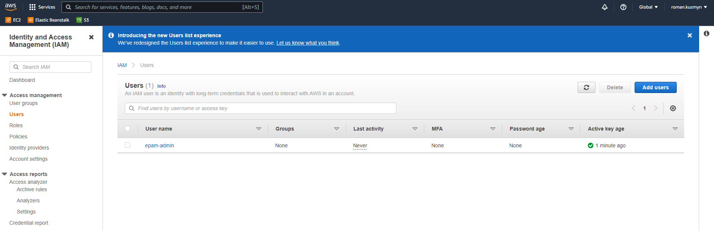
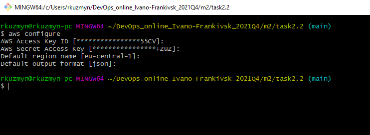

### 1. Read the terms of Using the AWS Free Tierand the ability to control their own costs.

### 2. Register with AWS(first priority)or alternatively, you can register with AWS Educateif you are currently a student.

### 3. Find the hands-on tutorialsand AWS Well-ArchitectedLabsfor your AWS needs. Explore list of step-by-step tutorials for deferent category. Use, repeat and have fun))

### 4. Review the 10-minute exampleLaunch a Linux Virtual Machinewith Amazon Lightsail. Repeat, create your own VM in the AWS cloud and connect to it. 

### 5. Launch anotherLinux Virtual MachinewithoutAmazon Lightsail.It is recommended to use the t2or t3.micro instance and the CentOS operating system.

### 6. Create a snapshot of your instance to keep as a backup.

### 7. Create and attach a Disk_D (EBS)to your instance to add more storage space.Create and save some file on Disk_D

### 8. Launch the third instance from backup.

### 9. Detach Disk_D from the 2nd instance and attach disk_D to the new instance.

### 10. Launch and configure a WordPress instancewith Amazon Lightsaillink

### 11. Review the 10-minute exampleStore and Retrieve a File. Repeat, creating your own repository.

### 12. Review the 10-minute exampleBatch upload files to the cloudto Amazon S3 using the AWS CLI.Create a user AWS IAM, configure CLI AWS and upload any files to S3. 

### 13. Review the 10-minute example.Explore the possibilities of creating your own domain and domain name for your site

### 15.Create a static website on Amazon S3, publicly available(link1or link2-using a custom domain registered withRoute 53).Post on the page your own photo, the name of the educational program(EPAM DevOps online Autumn2021),thelist of AWS services with which the student worked within the educational program or earlierand the full list with links of completed labs (based on tutorialsor qwiklabs).Provide the link to the websitein your reportand СV.

My website - [roman-kuzmyn.ddns.net/](https://roman-kuzmyn.ddns.net/ "roman-kuzmyn.ddns.net!").